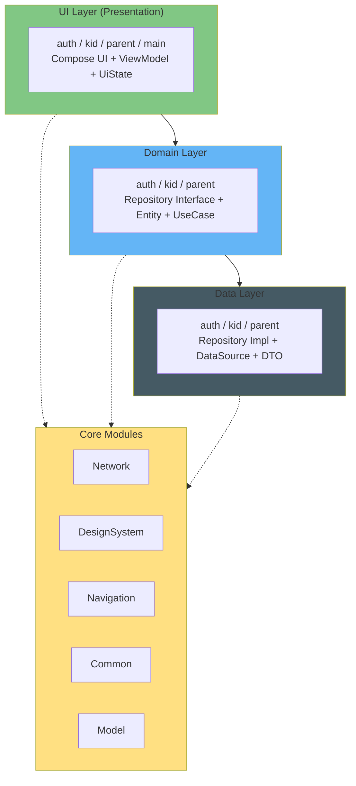

# Kiero-Android
Kiero 안드로이드 레포지토리 👶


<div align="center">


### 아이의 하루가 모험이 되는 곳


**초등학생 자녀의 일정 관리와 자기주도적 습관 형성을 돕는**  
**게이미피케이션 기반 성장 플랫폼**

[Download](#download) • [Features](#features) • [Architecture](#architecture)

</div>

---

## 💡 About Kiero

> "세상의 모든 아이는 '히어로'다"

**Kiero**는 'Kid(아이)'와 'Hero(히어로)'의 합성어입니다.

잔소리가 응원이 되고, 의무가 모험이 되는 곳.  
부모와 아이가 함께 성장하는 가족 운영 플랫폼을 만듭니다.

### For Parents 👑
잔소리 → 응원 | 불안 → 안심  
아이의 성취를 확인하고 칭찬하며, 흩어진 스케줄을 한곳에서 관리합니다.

### For Kids 🦸
의무 → 모험 | 통제 → 도전  
시간표가 모험 지도로 변하고, 스스로 퀘스트를 시작하며 보상을 획득합니다.

### For Family 👨‍👩‍👧‍👦
통제 → 협력  
함께 약속을 정하고 지켜나가며, 서로를 든든한 팀원으로 느낍니다.

---

## ✨ Features

### 🎯 서비스 플로우

```
부모의 설계 → 아이의 도전 → 가족의 보상 → 신뢰의 형성
```

**STEP 1. 부모의 설계**
- 일정 등록 → 아이 화면의 `오늘의 레시피`로 변환
- 미션 등록 → 아이 화면의 `마을 의뢰서`로 변환
- AI 알림장 입력기로 자동 미션 생성

**STEP 2. 아이의 도전**
- 퀘스트 수행 후 인증샷 제출
- 보석(포인트) 즉시 획득
- 현실의 성취가 게임 배경으로 반영

**STEP 3. 가족의 보상**
- 소원 상점에서 보석으로 쿠폰 교환
- 게임 30분 연장, 치킨 먹기 등 실질적 보상
- 노력의 가시화

**STEP 4. 신뢰의 형성**
- 부모는 피드로 아이의 성취 확인
- 승인과 칭찬 메시지 전송
- 선순환 구조 완성

---

## 📥 Download

<a href="https://play.google.com/store/apps/details?id=com.kiero">
  
</a>

---

## 🏗 Architecture

### Layer Structure

Google Recommended App Architecture를 기반으로 설계되었습니다.




### Package Structure

```
com.kiero
├── core/
│   ├── common
│   │   ├── extension/ Kotlin 확장 함수
│   │   └── util/ 공통 유틸 함수
│   ├── designsystem
│   │   ├── component/ 공통 UI 컴포넌트
│   │   └── theme/ 디자인 시스템 (Color, Typography 등)
│   ├── model/ 공통으로 사용하는 모델
│   ├── navigation/ 앱 전역 Navigation 정의
│   └── network
│       ├── di/ 네트워크 관련 DI 모듈
│       └── model/ 공통 네트워크 모델
│
├── data
│   ├── auth
│   │   ├── local
│   │   │   ├── datasource
│   │   │   └── datasourceimpl/ Local DataSource 구현체
│   │   ├── mapper/ DTO ↔ Domain Entity 매핑
│   │   ├── remote
│   │   │   ├── api/ Retrofit Service
│   │   │   ├── datasource
│   │   │   ├── datasourceimpl/ Remote DataSource 구현체
│   │   │   └── dto
│   │   └── repositoryimpl/ Domain Repository 구현체
│   │
│   ├── kid/ auth와 동일한 구조
│   ├── parent/ auth와 동일한 구조
│   └── di/ Data Layer DI 모듈
│
├── domain
│   ├── auth
│   │   ├── model/ Domain Entity
│   │   │   └── DummyEntity
│   │   └── repository/ Repository Interface
│   │       └── DummyRepository
│   │
│   ├── kid/ auth와 동일한 구조
│   └── parent/ auth와 동일한 구조
│
└── presentation
    ├── auth
    │   ├── component/ Auth 전용 UI 컴포넌트
    │   ├── model/ UiState, UiEvent, SideEffect
    │   ├── navigation/ Auth 관련 Navigation
    │   ├── viewmodel/ 상태 관리 (ViewModel)
    │   └── AuthScreen.kt
    │
    ├── kid
    ├── main
    ├── parent
    └── KieroApplication

```

------
## 👥 Contributors

<table>
  <tr>
    <td align="center">
      <a href="https://github.com/vvan2">
        <br />
        <sub><b>손주완 (Lead)</b></sub>
      </a>
      <br />
      <sub></sub>
    </td>
    <td align="center">
      <a href="https://github.com/sonms">
        <br />
        <sub><b>손민성</b></sub>
      </a>
      <br />
      <sub></sub>
    </td>
    <td align="center">
      <a href="https://github.com/seungjae708">
        <br />
        <sub><b>최승재</b></sub>
      </a>
      <br />
      <sub></sub>
    </td>
  </tr>
  <tr>
    <td align="center">
      <a href="https://github.com/dmp100">
        <br />
        <sub><b>성규현</b></sub>
      </a>
      <br />
      <sub></sub>
    </td>
    <td></td>
    <td></td>
  </tr>
</table>

---

<div align="center">

**Made with ❤️ by Kiero Team**

</div>