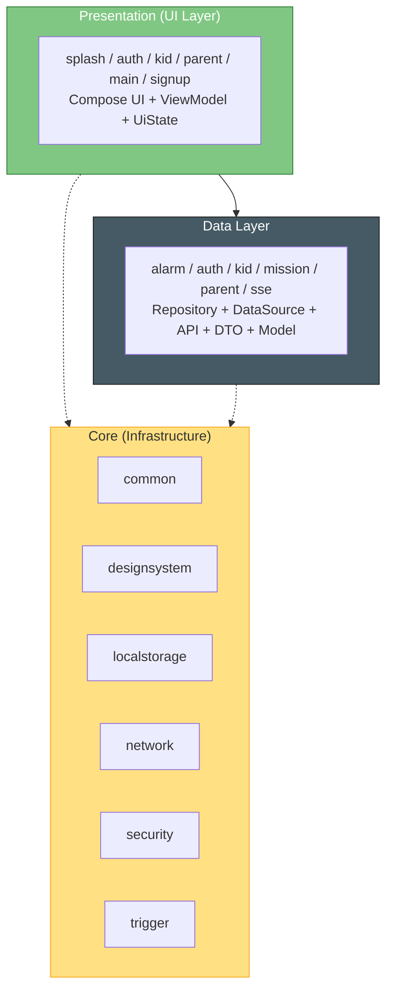

# Kiero-Android

#   Kiero 키어로

> 프로젝트 기간 | 2025.12.20 ~ ing

초등학생 자녀의 **일정 관리**와 **자기주도적 습관 형성**을 동시에 돕는  
게이미피케이션 기반 성장 플랫폼입니다.
<br>
<br>

<div align="center">


### 아이의 하루가 모험이 되는 곳


세상의 모든 아이는 히어로입니다.

Kiero는 그 믿음에서 시작된 가족 성장 플랫폼입니다.

부모는 응원으로, 아이는 도전으로 하루를 채웁니다.

그렇게 가족은 함께 성장하며,
일상 속 작은 성취를 이야기로 남깁니다. ✨


[About](#-about) • [Download](#-download) • [Architecture](#-architecture)

---
## 🌟 About

👇 이런 순간, Kiero가 함께합니다

- 해야 할 일마다 "하자!" 대신 "싫어…"로 대답할 때
- 아이의 하루를 관리가 아닌 성장으로 기록하고 싶을 때
- 가족이 함께 목표를 세우고 칭찬과 보상을 나누고 싶을 때
- "오늘은 잘했다"는 말을 놀이처럼 전하고 싶을 때

📱 Kiero와 함께라면
하루의 미션이 도전으로, 도전이 성취로,
그리고 가족의 일상이 이야기로 이어집니다. ✨

---


<br>
<br>

## 👥 Contributors

<table>
  <tr>
    <td align="center" width="25%">
      <a href="https://github.com/vvan2">
        
        <br />
        <sub><b>손주완 (Lead)</b></sub>
      </a>
    </td>
    <td align="center" width="25%">
      <a href="https://github.com/sonms">
        
        <br />
        <sub><b>손민성</b></sub>
      </a>
    </td>
    <td align="center" width="25%">
      <a href="https://github.com/seungjae708">
        
        <br />
        <sub><b>최승재</b></sub>
      </a>
    </td>
    <td align="center" width="25%">
      <a href="https://github.com/dmp100">
        
        <br />
        <sub><b>성규현</b></sub>
      </a>
    </td>
  </tr>
  <tr>
    <td align="center">
      <sub>부모 스케쥴 관리, 미션 직접 추가</sub>
    </td>
    <td align="center">
      <sub>자녀 및 부모 회원가입 뷰, 자녀 소원의 우물</sub>
    </td>
    <td align="center">
      <sub>자녀 오늘의 여정 뷰, 자녀 금화 미션</sub>
    </td>
    <td align="center">
      <sub>카카오 로그인, 부모 실시간 알림 피드, AI 미션 자동추가</sub>
    </td>
  </tr>
</table>

---

## 📥 Download

추후 스프린트 이후 구글 플레이 스토어에 출시할 예정입니다.

<!-- <a href="https://play.google.com/store/apps/details?id=com.kiero">
  
</a> -->

---

## 🏗 Architecture

### Layer Structure

Google Recommended App Architecture를 기반으로 설계되었습니다.



### ⚙️ Tech Stack

| Category                 | Stack                                                           |
| ------------------------ | --------------------------------------------------------------- |
| **Architecture**         | Google Recommended App Architecture (MVVM)                      |
| **UI**                   | Jetpack Compose · Material3                                     |
| **Asynchronous**         | Kotlin Coroutines · Flow                                        |
| **Dependency Injection** | Hilt 2.57.2                                                     |
| **Networking**           | Retrofit 3.0.0 · OkHttp 5.3.2 · Kotlin Serialization            |
| **Local Storage**        | DataStore · Google Tink (Encrypted Storage)                     |
| **Image Loading**        | Coil 2.7.0 (GIF Supported)                                      |
| **Logging**              | Timber                                                          |
| **Auth SDK**             | Kakao SDK 2.20.6                                                |
| **Modularization**       | Android App Modularization                                      |
| **Build Configuration**  | Gradle Version Catalog · Custom Convention Plugins              |

### 📦 Package Structure

</div>

```
app/
 ┣━ ⚙️ build.gradle.kts
 ┣━ 🛡 proguard-rules.pro
 ┗━ 📂 src/
     ┣━ 📂 main/
     │   ┣━ 📜 AndroidManifest.xml
     │   ┣━ 📂 java/com/kiero/
     │   │   ┣━ 🧩 core/                # 공통 인프라 계층
     │   │   │   ┣━ common/             # Base, 유틸, 확장함수
     │   │   │   ┣━ designsystem/       # Compose 디자인 시스템 (버튼, 다이얼로그, 테마 등)
     │   │   │   ┣━ localstorage/       # Token, Onboarding, DataStore
     │   │   │   ┣━ network/            # Retrofit, Interceptor, DI 모듈
     │   │   │   ┣━ security/           # 암호화 및 보안 관리
     │   │   │   ┗━ trigger/            # 전역 이벤트 및 상태 트리거
     │   │   │
     │   │   ┣━ 📚 data/                # 데이터 계층 (API, Repository, Model)
     │   │   │   ┣━ alarm/              # 알림 기능
     │   │   │   ┣━ auth/               # 인증 / 로그인 / 회원가입
     │   │   │   ┣━ kid/                # 아이 관련 데이터 (코인, 스케줄, 위시)
     │   │   │   ┣━ mission/            # 미션 데이터 (자동미션 등)
     │   │   │   ┣━ parent/             # 부모 관련 데이터 (계획, 미션관리)
     │   │   │   ┗━ sse/                # 실시간 이벤트 (Server-Sent Events)
     │   │   │
     │   │   ┣━ 🎨 presentation/        # UI 계층 (Compose)
     │   │   │   ┣━ splash/             # 스플래시 화면
     │   │   │   ┣━ auth/               # 로그인 / 회원가입
     │   │   │   ┣━ kid/                # 아이 앱 화면 (여정, 미션, 위시, 온보딩)
     │   │   │   ┣━ parent/             # 부모 앱 화면 (알림, 일정, 플랜, 미션)
     │   │   │   ┣━ main/               # 메인 액티비티, 네비게이션 구조
     │   │   │   ┗━ signup/             # 부모 회원가입 플로우
     │   │   │
     │   │   ┗━ 🚀 KieroApplication.kt   # 앱 진입점 (Application 클래스)
     │   │
     │   ┗━ 📂 res/
     │       ┣━ 🎨 drawable/            # 벡터/아이콘 리소스
     │       ┣━ 📑 values/              # 색상, 문자열, 테마
     │       ┗━ ⚙️ xml/                 # 환경 설정 (backup_rules 등)
     │
     ┣━ 🧪 test/
     │   └── java/com/kiero/ExampleUnitTest.kt
     ┗━ 🧩 androidTest/
         └── java/com/kiero/ExampleInstrumentedTest.kt
```

<div align="center">

---

## 📚 Notion

- [컨벤션](https://ruddy-adapter-e98.notion.site/2d58ff4aed3f809397e7c940a41beafa?source=copy_link)
- [담당화면](https://ruddy-adapter-e98.notion.site/2d58ff4aed3f8087a51cff4f620c53e2?source=copy_link)
- [API 담당](https://ruddy-adapter-e98.notion.site/API-2f18ff4aed3f8014afb7cea46529ff9e?source=copy_link)

---

**Made with ❤️ by Kiero Team**

</div>
